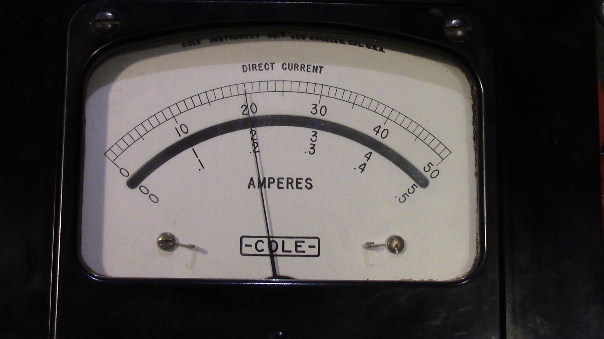
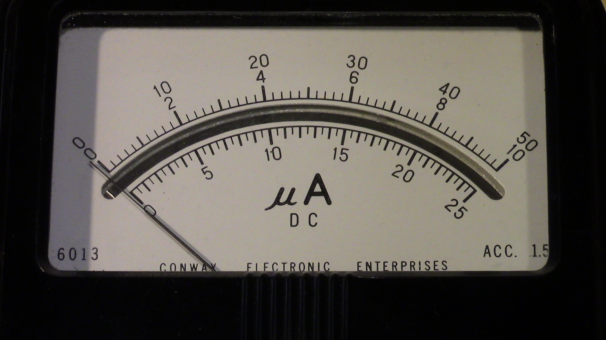
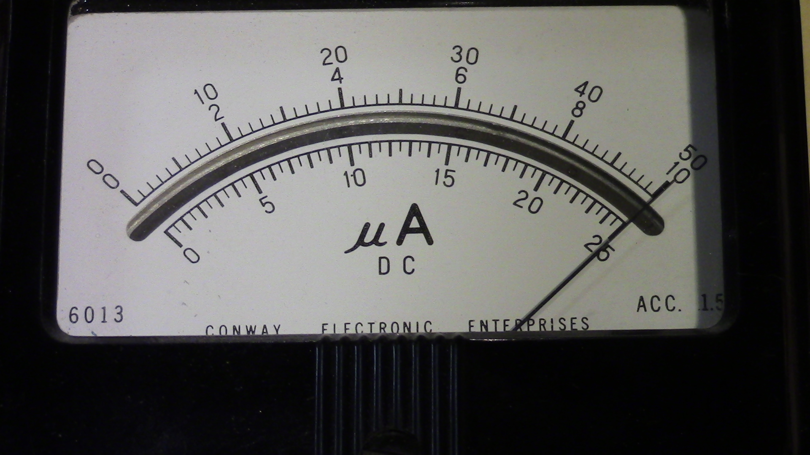
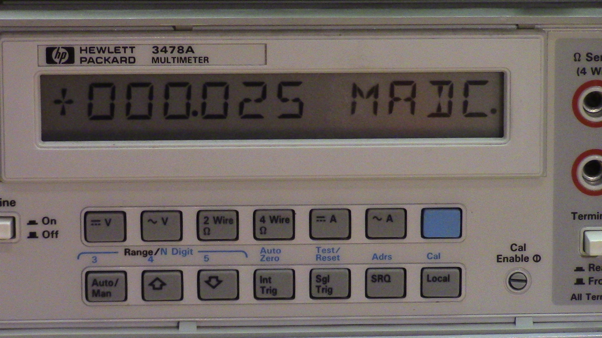

Analog Thermometer
===================

A small, simple, low power circuit that turns practically any analog ammeter into an attractive thermometer, displaying temperatures from 0-70C with a typical accuracy of +-1 degree celcius.

  * One inch square PCB size
  * Low cost (single quantity [components](./digikey_bom.csv): $7, OSHPark PCB: $5)
  * Runs from a single 2.5-5.5V supply, current consumption <15uA (plus analog meter current requirements)
  * Easily adapted to work with nearly any ammeter by changing a single resistor, and/or adjusting a potentiometer




Circuit Description
===================

The AnalogThermometer circuit is based around a Microchip MCP9700A temperature sensor. An LTC1541 op-amp is used as a differential amplifier to remove the 500mV offset voltage from the MCP9700A's output voltage. Finally, the differential amplifier controls a simple NPN current sink, whose current varies linearly with temperature; this provides a constant current to drive the analog ammeter that is proportional to the ambient temperature.

Circuit Construction
====================

Circuit construction is largely the same for any analog meter, with only two design questions that must be answered:

1. Do you want the MCP9700A temperature sensor to be a surface mount or a through-hole component?
2. What resistor value should be used for resistor R7 in order to accurately display the temperature on your analog meter?

Surface mount or through-hole?
------------------------------

Provisions have been made on the PCB for both the through-hole and surface mount versions of the MCP9700A temperature sensor. There is no technical advantage one way or the other, so the decision of which one to use is primarily determined by physical constraints / personal preference.

In the schematic and on the PCB, U2 is the through-hole version (TO-92 package) and U3 is the surface mount version (SOT-23). **Populate either U2 or U3, but not both!**

What value resistor do I use for R7?
------------------------------------

Different analog meters require different amounts of current for full-scale deflection of the meter's needle. The selection/adjustment of resistors R7/RV1 directly determines how much current is put through the analog meter for each degree of temperature change.

The easy way to set the correct amount of current is to simply not populate resistor R7 at all and adjust the potentiometer RV1 until the analog meter reads the correct temperature. If you choose this option, that's all you need to do and your work is done. The downsides to this however is that it requires fiddly adjustments, and will inevitably be less accurate than selecting a fixed resistor of the correct value.

The preferred method is to leave the potentiometer RV1 unpopulated and calculate exactly the correct amount of resistance required. Resistor R7 can then be populated with a fixed resistor of the appropriate value.

The amount of current that your analog meter requires is determined by the full-scale deflection current of your meter, and the scale printed on the meter's faceplate. Alan, W2AEW, has made some excellent videos on [finding the full-scale deflection current of a meter](https://www.youtube.com/watch?v=wbRx5cQZ8Ts&t=3m22s), as well as [printing custom scales for the face
plate](https://www.youtube.com/watch?v=wbRx5cQZ8Ts&t=13m09s). **His videos are highly recommended if you are not familiar with analog meters**.

Here is a simple example. This particular meter was manufactured with a scale of 0-50uA on the faceplate, which is ideal for our application as the temperature in degrees celcius can be read directly from the existing scale:



Having settled on a scale of 0-50, all that is left is to determine how much current is required to deflect the needle full-scale. Some analog meters will have this value conveniently printed on them:


The text `FS=50UADC` on this meter tells us that 50uA of direct current will deflect the meter to its full-scale position.

Unfortunately, the analog meter used in our example does not have this information printed on it, but it is easy to experimentally determine the full-scale current by placing a current meter in series between an adjustable voltage power supply and the analog meter:

< TODO: schematic here >

Simply increase the power supply voltage until the needle is deflected full-scale, then read the current measured by the current meter. In this case, it is 25uA:





Since our scale ranges from 0 to 50 degrees, and the current required for a full-scale reading of 50 degrees is 25uA, we can calculate how much current is required to move the needle by one degree on our 0-50 scale:

```
25uA / 50 = 0.5uA
```

So we need the current to increase by 0.5uA for a one degree increase in temperature. The AnalogThermometer circuit increases the voltage across resistor R7 by 10mV for a one degree celcius increase, so ohm's law tells us that resistor R7 must be:

```
10mV / 0.5uA = 20,000
```

A 20k ohm resistor can be used for resistor R7. Resistors with tolerances of 1% or better are recommended.

